# System Architecture — VEER Forex Observatory

This document outlines the technical architecture, subsystem interactions, component hierarchy, and data flow of the VEER Forex Observatory application.

---

## 1. High-Level Architecture Diagram

```mermaid
graph TD
    User([User / Browser Viewport]) -->|Interacts| MainHTML[index.html]
    MainHTML -->|Mounts| MainTSX[src/main.tsx]
    MainTSX -->|Renders| App[src/App.tsx]

    subgraph Core Providers & Engines
        App --> ThemeProvider[ThemeContext.tsx<br/>Adaptive Dynamic Spectrum]
        App --> LenisEngine[Lenis Smooth Scroll Engine<br/>Inertial RAF Loop]
        App --> GSAPEngine[GSAP ScrollTrigger Registry<br/>Hardware Transform Pipeline]
        App --> Analytics[Vercel Web Analytics]
    end

    subgraph Global Persistent Layer
        ThemeProvider --> AmbientCanvas[ChromaticAmbientCanvas.tsx<br/>Full-Screen Dynamic Aurora WebGL/CSS]
        App --> Preloader[Preloader.tsx<br/>Initial Asset & Font Sync]
        App --> CustomCursor[CustomCursor.tsx<br/>Dual-Ring Reticle Mouse Tracker]
        App --> Navbar[Navbar.tsx<br/>Floating Fixed Navigation Desk]
        App --> Footer[Footer.tsx<br/>Institutional Disclaimer & Links]
    end

    subgraph Section Sequence [Continuous Poster Flow]
        App --> Hero[00. ForexHeroSection + FinancialArtifact3D]
        App --> Profile[01. TraderProfile]
        App --> Watching[02. CurrencyWatchingSection + CurrencyWatching3D]
        App --> Universe[03. GlobalForexMarket + ForexMarketCore]
        App --> Strength[04. CurrencyStrengthSection + CurrencyStrength3D]
        App --> Sessions[05. ForexSessionsSection + WorldClock3D]
        App --> Liquidity[06. LiquiditySection + ForexFlowField]
        App --> Dashboard[07. ForexDashboardSection]
        App --> Equity[08. EquityCurveSection]
        App --> Journal[09. ForexJournalSection + TradeModal]
        App --> Macro[10. MacroLayerSection]
        App --> Psychology[11. PsychologySection]
        App --> Curriculum[12. PlaybookCurriculumSection]
        App --> Pricing[13. MentorshipPricingSection]
        App --> Community[14. CommunitySection]
        App --> Contact[15. ContactSection]
        App --> FinalCTA[16. FinalCTASection]
    end

    subgraph Data Layer [Immutable Domain Models]
        ForexPairsData[(forexPairs.ts)] --> Universe
        CurrencyStrengthData[(currencyStrength.ts)] --> Strength
        SessionsData[(sessionsData.ts)] --> Sessions
        PortfolioData[(forexPortfolio.ts)] --> Dashboard
        PortfolioData --> Equity
        JournalData[(forexJournal.ts)] --> Journal
        MacroData[(macroData.ts)] --> Macro
        CurriculumData[(forexStrategy.ts)] --> Curriculum
        MentorshipData[(mentorshipData.ts)] --> Pricing
        ChromaticThemes[(chromaticThemes.ts)] --> ThemeProvider
    end
```



---

## 2. Directory Structure & Organization

```
Veer Portfolio/
├── .agents/                      # AI assistant guidelines, rules & design skills
├── .impeccable/                  # Impeccable design system tokens & design files
├── dist/                         # Optimized production bundle (generated by vite build)
├── docs/                         # Comprehensive developer & AI documentation
│   ├── AI_CONTEXT.md             # Targeted guidance for future AI coding agents
│   ├── ARCHITECTURE.md           # Subsystem design, state flow, and graphics pipeline
│   ├── CHANGELOG.md              # Semantic release notes and historical modifications
│   ├── COMPONENTS.md             # Complete inventory and API specifications of components
│   ├── DEVELOPMENT_GUIDE.md      # Setup, contribution rules, patterns, and workflows
│   ├── PROJECT_OVERVIEW.md       # Product vision, audience, and core capabilities
│   └── STYLING_GUIDE.md          # CSS design tokens, typography, colors, and animations
├── public/                       # Static public assets (favicons, SVGs)
├── src/
│   ├── components/
│   │   ├── 3d/                   # Three.js / React Three Fiber interactive scenes
│   │   │   ├── CurrencyStrength3D.tsx    # 3D spatial currency node cluster
│   │   │   ├── CurrencyWatching3D.tsx    # Spatial radar wireframe visualizer
│   │   │   ├── FinancialArtifact3D.tsx   # Hero multi-ringed procedural 3D artifact
│   │   │   ├── ForexFlowField.tsx        # Interactive mouse-repulsion particle field
│   │   │   ├── ForexMarketCore.tsx       # Rotating global currency orbital sphere
│   │   │   ├── LiquidityMap3D.tsx        # 3D depth block for liquidity pools
│   │   │   └── WorldClock3D.tsx          # 3D session timeline and globe arcs
│   │   ├── layout/               # Global structural wrappers
│   │   │   ├── Footer.tsx                # Terminal footer and legal disclosure
│   │   │   └── Navbar.tsx                # Floating glass navigation pill with live clock
│   │   ├── sections/             # Modular, self-contained editorial sections
│   │   │   ├── CommunitySection.tsx      # Trader network & communication hub
│   │   │   ├── ContactSection.tsx        # Direct contact & inquiry terminal
│   │   │   ├── CurrencyStrengthSection.tsx # Strength delta & divergence matrix
│   │   │   ├── CurrencyWatchingSection.tsx # Market surveillance thesis section
│   │   │   ├── EditorialQuoteDivider.tsx # Full-bleed transition typography dividers
│   │   │   ├── EquityCurveSection.tsx    # Interactive capital growth & drawdown SVG
│   │   │   ├── FinalCTASection.tsx       # Closing call-to-action & terminal prompt
│   │   │   ├── ForexDashboardSection.tsx # Verified metrics grid & quick trade summary
│   │   │   ├── ForexHeroSection.tsx      # Asymmetrical hero poster & artifact anchor
│   │   │   ├── ForexIntelligenceSection.tsx # Intelligence and orderflow breakdown
│   │   │   ├── ForexJournalSection.tsx   # Paginated trade logs & post-mortem launcher
│   │   │   ├── ForexRadarSection.tsx     # Session overlap and timing visualizer
│   │   │   ├── ForexSessionsSection.tsx  # Active session radar & 3D world clock
│   │   │   ├── GlobalForexMarket.tsx     # Searchable live pair catalog & sparklines
│   │   │   ├── LiquiditySection.tsx      # Orderflow, BSL/SSL pools & flow field
│   │   │   ├── MacroLayerSection.tsx     # Central bank stance & rate differentials
│   │   │   ├── MentorshipPricingSection.tsx # Pricing matrix & enrollment packages
│   │   │   ├── PlaybookCurriculumSection.tsx# SMC curriculum syllabus & topic breakdown
│   │   │   ├── PsychologySection.tsx     # Risk management & psychological discipline
│   │   │   └── TraderProfile.tsx         # Identity, operational methodology & stats
│   │   └── ui/                   # Reusable micro-components and overlays
│   │       ├── ChromaticAmbientCanvas.tsx# Dynamic background aurora engine
│   │       ├── ChromaticThemeBar.tsx     # Legacy theme controller (kept for fallback)
│   │       ├── CustomCursor.tsx          # Hardware reticle dual-ring mouse pointer
│   │       ├── Preloader.tsx             # Cinematic startup loading sequence
│   │       ├── StatusBadge.tsx           # Reusable status pill (WIN, LOSS, LONG, etc.)
│   │       └── TradeModal.tsx            # Comprehensive trade post-mortem dialog
│   ├── context/
│   │   └── ThemeContext.tsx      # Adaptive theme provider & ScrollTrigger bridge
│   ├── data/                     # Strictly typed immutable datasets
│   │   ├── chromaticThemes.ts    # Color definitions and aura presets for sections
│   │   ├── currencyStrength.ts   # 8-currency strength scores and bias rankings
│   │   ├── economicCalendar.ts   # High-impact news releases and forecasts
│   │   ├── editorialQuotes.ts    # Section transition aphorisms and quotes
│   │   ├── forexJournal.ts       # Trade entries with screenshots, thesis, and lessons
│   │   ├── forexPairs.ts         # Major, Cross, and Metal pairs with live candle data
│   │   ├── forexPortfolio.ts     # Verified account balance, equity curve, win metrics
│   │   ├── forexStrategy.ts      # SMC execution playbooks & curriculum syllabus
│   │   ├── macroData.ts          # Central bank policy stances and macro trends
│   │   ├── mentorshipData.ts     # Tiered mentorship packages, pricing, and features
│   │   └── sessionsData.ts       # Tokyo, London, NY, Sydney hours & volume shares
│   ├── types/
│   │   └── index.ts              # Global TypeScript interfaces and domain types
│   ├── App.tsx                   # Master application orchestrator and Lenis setup
│   ├── index.css                 # Obsidian tokens, glassmorphism, and custom scrollbars
│   ├── main.tsx                  # React 19 root DOM hydration
│   └── vite-env.d.ts             # Vite client type references
├── index.html                    # HTML5 entry, Google font preloading, dark class
├── package.json                  # Scripts and dependencies
├── postcss.config.js             # PostCSS Tailwind and Autoprefixer integration
├── tailwind.config.js            # Custom colors, fonts, keyframes, and animations
├── tsconfig.json                 # TypeScript compiler configuration
├── vercel.json                   # SPA routing rewrites and build targets
└── vite.config.ts                # Vite dev server (port 3000) and alias configuration
```

---

## 3. Application Lifecycle & Bootstrapping Flow

1. **HTML & Font Preload**:
   `index.html` connects to Google Fonts via `<link rel="preconnect">` to download **Cinzel**, **Inter**, **Outfit**, and **JetBrains Mono**. It enforces the dark background `#050505` to prevent any FOUC (Flash of Unstyled Content).
2. **React 19 Root Mounting**:
   `src/main.tsx` mounts `<App />` onto `document.getElementById('root')`.
3. **Lenis + GSAP Synchronization**:
   Inside `src/App.tsx`, an instance of `Lenis` is constructed with smooth inertia physics (`duration: 1.15`, custom exponential decay ease).
   - `lenis.on('scroll', ScrollTrigger.update)` links scroll updates to GSAP.
   - `gsap.ticker.add((time) => lenis.raf(time * 1000))` synchronizes Lenis's requestAnimationFrame loop directly into GSAP's master ticker.
   - `gsap.ticker.lagSmoothing(0)` ensures zero judder or frame skips during high-load animations.
4. **Preloader Execution**:
   The cinematic preloader executes a progress timeline from `0%` to `100%`, initializing the terminal telemetry counter and fading away gracefully once the page components mount.
5. **Theme Engine & ScrollTrigger Binding**:
   `ThemeContext.tsx` sets up listeners across 16 registered section IDs (`#hero`, `#about`, `#watching`, `#forex-market`, etc.). As the viewport intersects each section, `ScrollTrigger` fires callbacks that update the active color specimen (`cosmic`, `opal`, `navy`, `violet`, `burgundy`), dynamically modifying CSS variables across `:root` and shifting the ambient background canvas.

---

## 4. State Management Strategy

The project deliberately utilizes **lightweight, unidirectional React state** instead of heavy external state stores (like Redux or Zustand), since data models represent an immutable, audited institutional record.

| State Slice | Owner Component | Mechanism | Purpose |
| :--- | :--- | :--- | :--- |
| **Active Theme / Specimen** | `ThemeContext.tsx` | React Context (`useContext`) | Drives root CSS variables and ambient canvas across all children. |
| **Dynamic Section Key** | `ThemeContext.tsx` | `useState` + GSAP `ScrollTrigger` | Synchronizes active chromatic atmosphere with scroll position. |
| **Preloader Visibility** | `App.tsx` | `useState(true)` | Controls initial boot sequence and cursor display. |
| **Selected Forex Category** | `GlobalForexMarket.tsx` | `useState<'ALL' \| 'MAJOR' \| ...>` | Filters the 12-pair currency list in real time. |
| **Selected Currency Pair** | `GlobalForexMarket.tsx` | `useState<ForexPair>` | Updates active pair sparkline and metrics inspector. |
| **Active Trade Modal** | `ForexJournalSection.tsx` | `useState<TradeEntry \| null>` | Controls full-screen trade analysis dialog. |
| **Mentorship Billing Cycle** | `MentorshipPricingSection.tsx` | `useState<'monthly' \| 'quarterly'>` | Calculates tiered pricing discounts. |
| **Mobile Drawer Open/Close** | `Navbar.tsx` | `useState(false)` | Toggles mobile navigation slide-over. |

---

## 5. 3D WebGL Graphics Pipeline

The 3D visualization layer leverages **Three.js** through **React Three Fiber (R3F)** and **@react-three/drei**.

### Design Principles for WebGL in VEER
1. **Low Draw-Call Footprint**:
   Particle fields (`ForexFlowField.tsx`) use a single `THREE.Points` object with `THREE.BufferAttribute` Float32 arrays for both position and vertex color, rendering hundreds of reactive particles in **1 single draw call**.
2. **CPU-Light Vector Physics**:
   Real-time cursor repulsion in `ForexFlowField` calculates distance vectors directly within `useFrame` using delta time, wrapping particle coordinates to boundary limits without garbage-collection penalties.
3. **Graceful Lifecycle Management**:
   Each R3F `<Canvas>` handles its own WebGL context. Contexts are automatically disposed on component unmount, preventing GPU memory leaks during long browsing sessions.
4. **Pointer Events Optimization**:
   3D canvases that serve purely atmospheric purposes (e.g. `FinancialArtifact3D.tsx`, `CurrencyWatching3D.tsx`) are assigned `pointer-events: none` on their parent containers so user scroll and mouse movements remain entirely uninhibited.

---

## 6. Build, Bundling & Deployment Architecture

- **Vite 5.4**: Employs esbuild for ultra-fast local HMR and Rollup for tree-shaken, production-optimized chunking.
- **Path Aliasing**: Configured in both `vite.config.ts` and `tsconfig.json` with `@/` resolving to `./src/`.
- **Production Asset Output**:
  - `dist/index.html` (~2.1 kB)
  - `dist/assets/index-[hash].css` (~46.7 kB, gzip: ~8.4 kB)
  - `dist/assets/index-[hash].js` (~1.4 MB minified with Three.js, GSAP, and Lucide)
- **Deployment Strategy**:
  - Pre-configured for **Vercel** via `vercel.json` with client-side SPA rewrites (`"source": "/(.*)", "destination": "/index.html"`).
  - Compatible with Netlify, Cloudflare Pages, GitHub Pages, or any modern static hosting provider.
